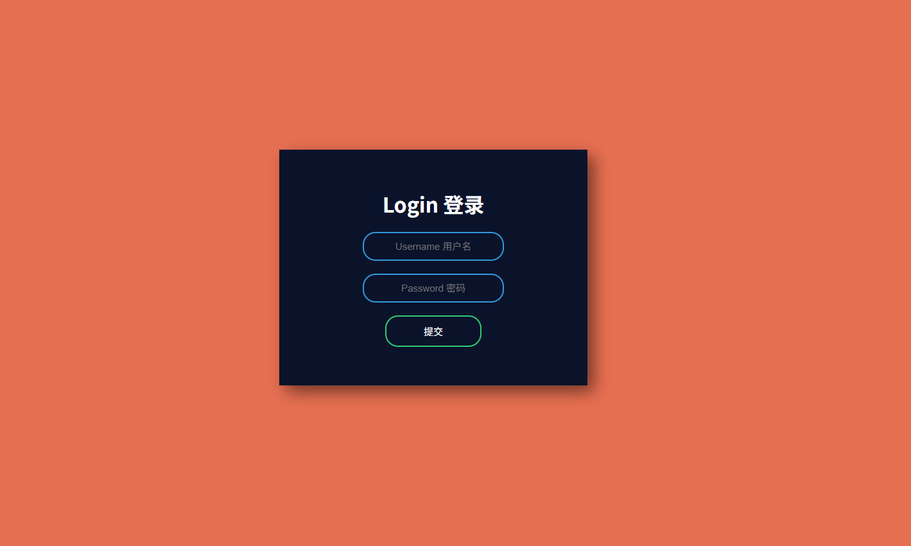

[README](README.md)
# 简易 HTML & CSS 登录页面

这是一个适合初学者学习的项目，展示了如何使用 **HTML** 和 **CSS** 创建一个简洁美观的登录页面。

## 🌟 项目特点

- 简洁语义化的 HTML 页面结构
- 使用 Flexbox 居中布局
- 输入框聚焦时带有动画效果
- 简洁现代的 UI 设计
- 支持中英文双语提示文本

## 📁 项目结构

```

.
├── Login.html     # 主 HTML 页面
├── style.css      # 外部样式表
├── action.js      # （预留的 JavaScript 登录逻辑）

```

## 🔧 使用方法

1. **克隆或下载** 本项目源码；
2. 用浏览器打开 `Login.html` 文件；
3. 即可看到一个美观的登录页面，包括用户名和密码输入框。

## 🖥️ 页面预览

登录页面包括：

- 橙红色背景（`#e76f51`）
- 深色背景的登录卡片，白色字体
- 输入框聚焦时宽度增加、边框颜色变化
- 鼠标悬停时按钮变色

## 💡 学习要点

本项目有助于掌握以下技能：

- 使用 Flexbox 实现页面元素的居中布局
- 设置元素的内边距、外边距与阴影效果
- 表单输入框样式的自定义
- CSS 动画与过渡效果的实现

## 🚀 可拓展方向

- 添加 JavaScript 表单验证（`action.js`）
- 实现响应式布局，适配手机端
- 增加暗黑模式切换功能

## 📄 开源协议

本项目为开源项目，欢迎自由学习与修改使用。

